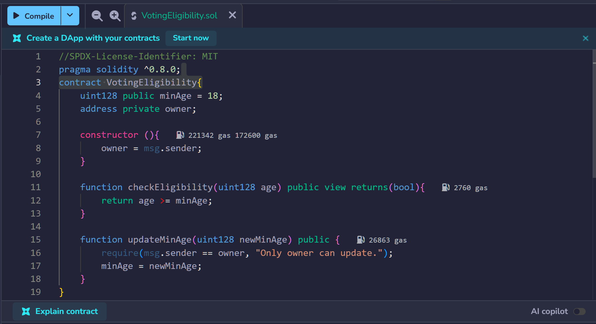
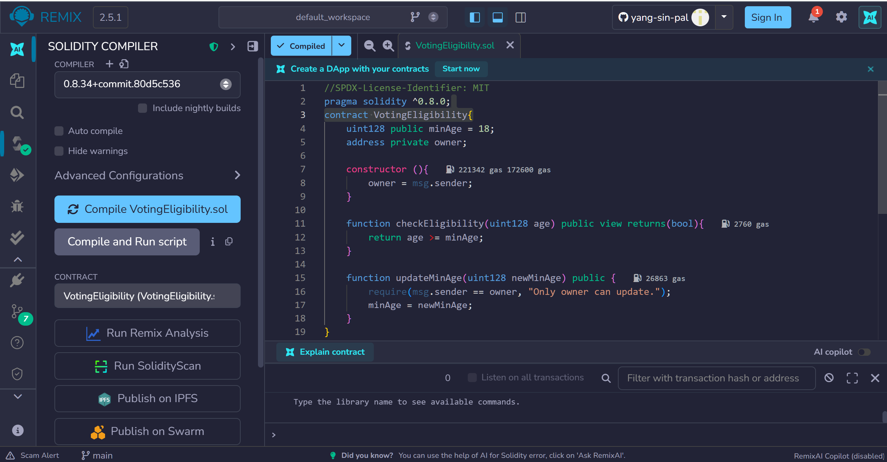
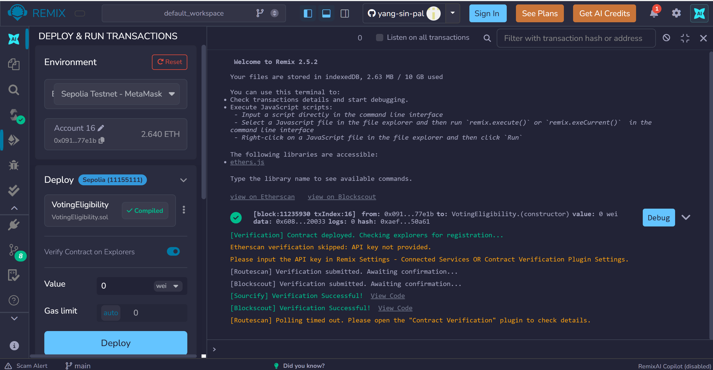
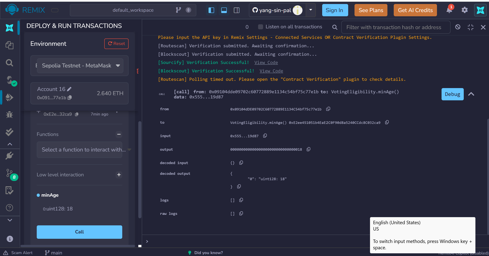
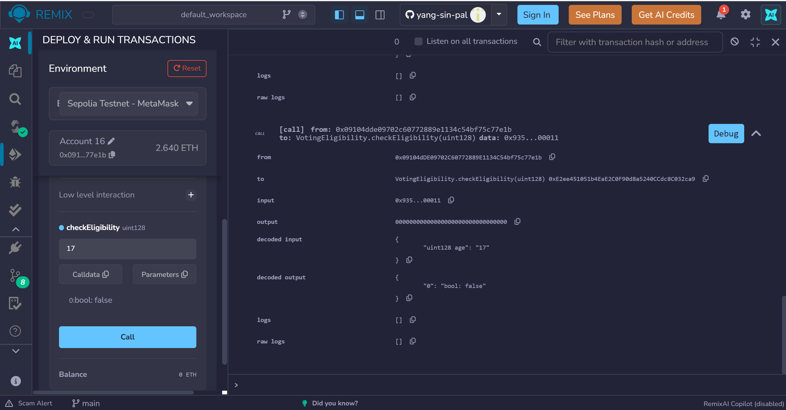
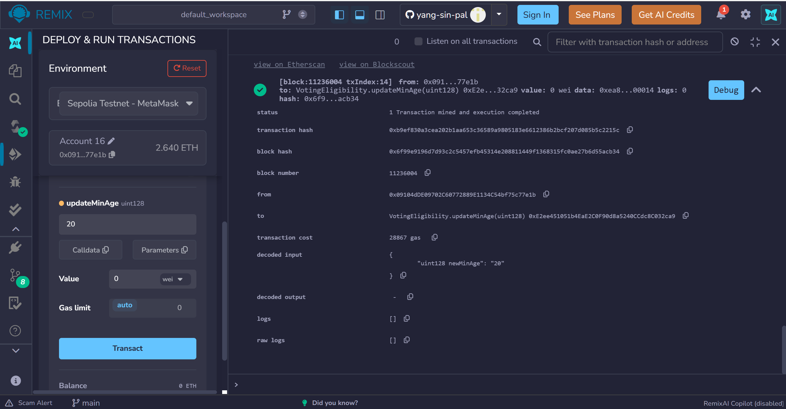
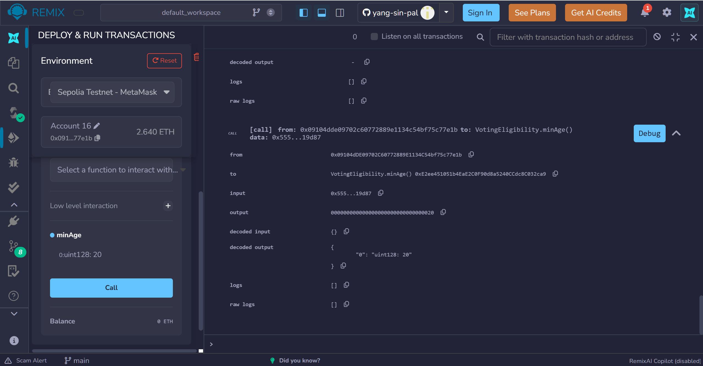
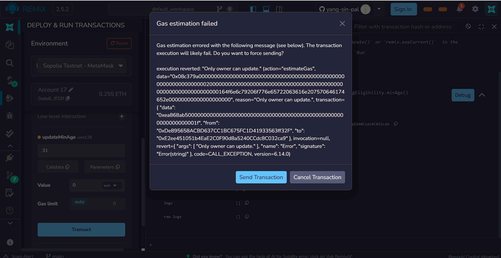

# Bài 3.2 – Báo cáo

#### 1. Viết mã nguồn hợp đồng trên Remix IDE

#### 2. Biên dịch hợp đồng

#### 3. Triển khai hợp đồng

#### 4. Kiểm tra giá trị `minAge` ban đầu (mặc định = 18)

#### 5. Kiểm tra `checkEligibility(17)` → `false` (nhỏ hơn 18)

#### 6. Kiểm tra `checkEligibility(18)` → `true` (bằng 18)

#### 7. Kiểm tra `checkEligibility(19)` → `true` (lớn hơn 18)

#### 8. Cập nhật `minAge` thành 20 bằng `updateMinAge(20)`

#### 9. Xác nhận `minAge` đã được cập nhật thành 20

#### 10. Kiểm tra ràng buộc owner: gọi `updateMinAge` bằng tài khoản không phải owner → revert

