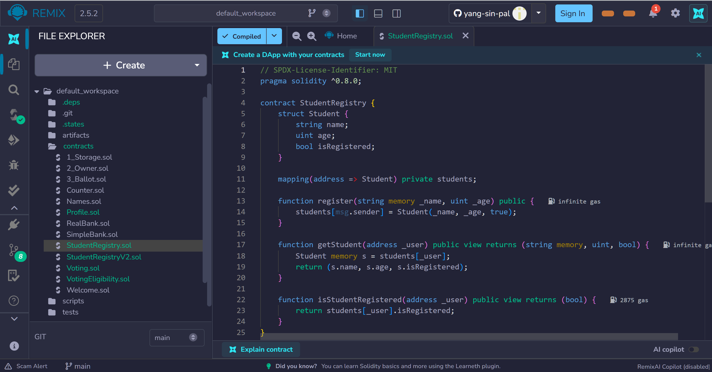
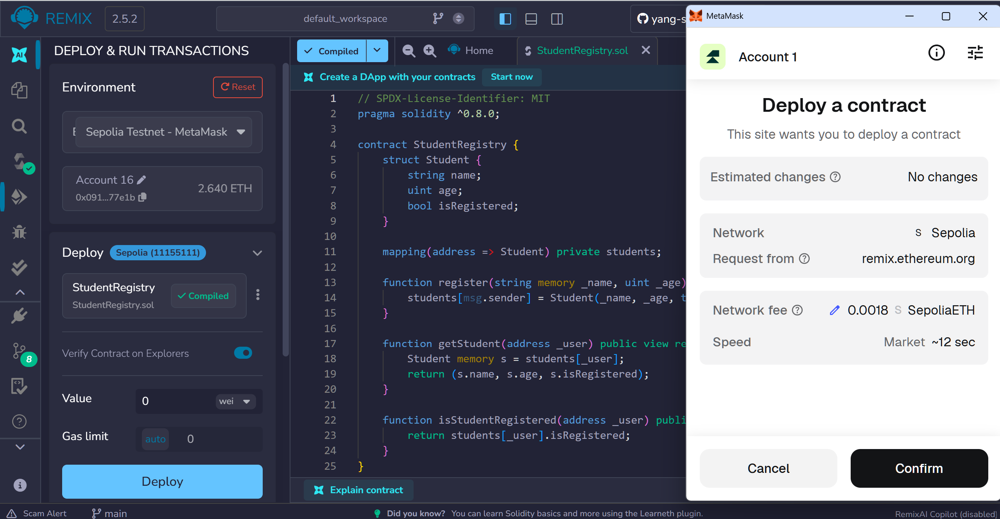
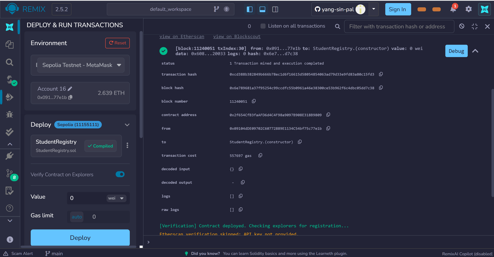
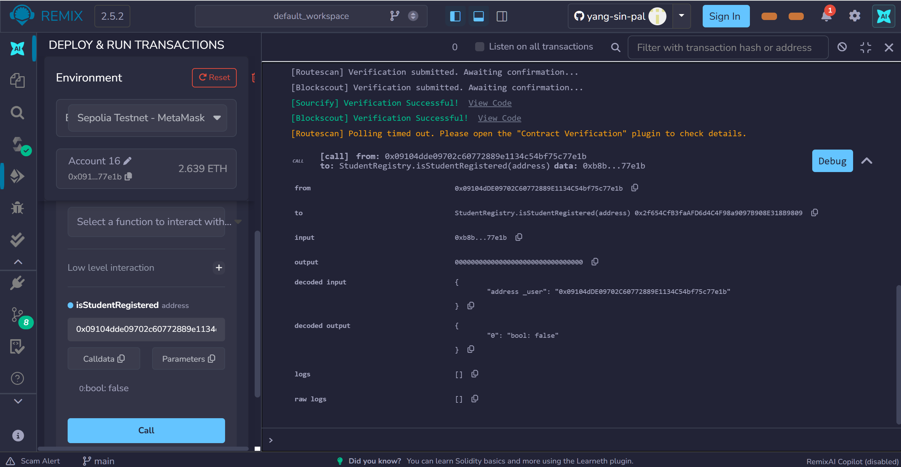
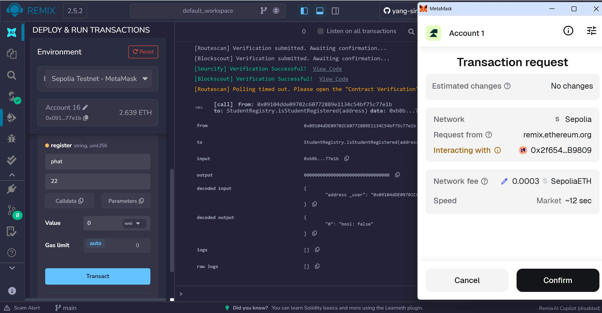
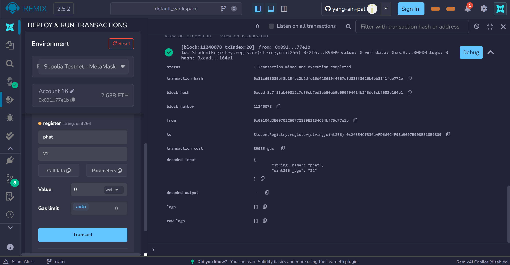
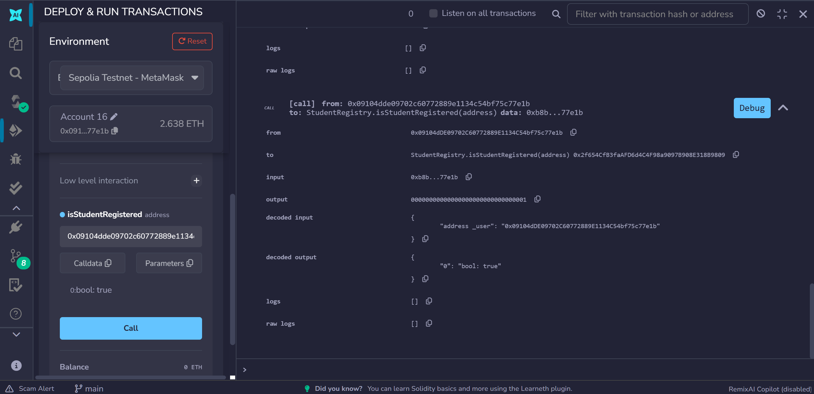
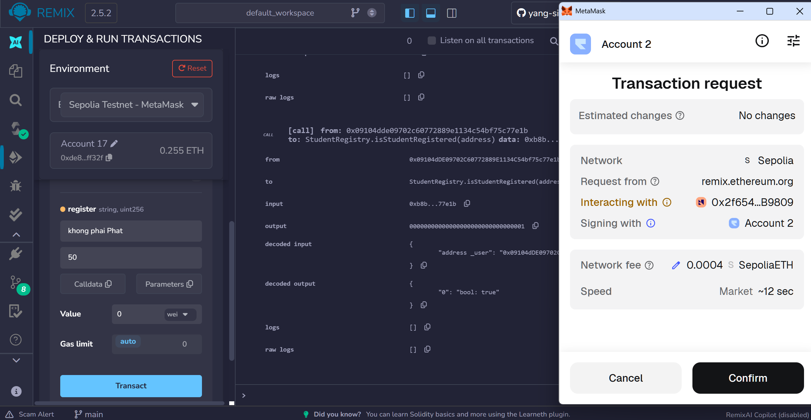
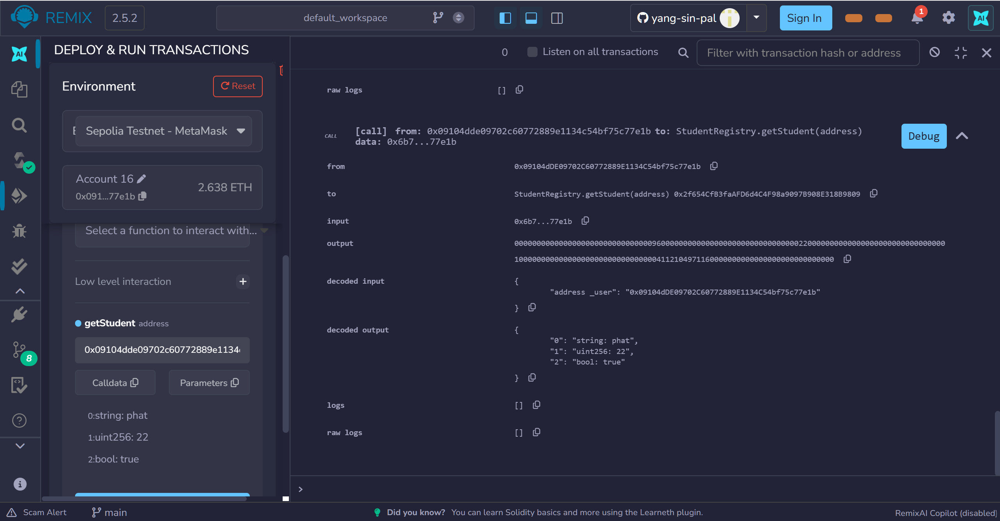
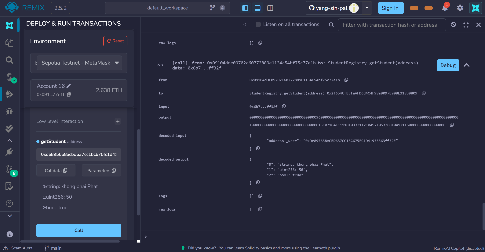

# Lesson 4.1 – Report
#### 1. Write and compile the StudentRegistry contract

#### 2. Deploy the contract

#### 3. Check isStudentRegistered for account 1 before registering – result: false

#### 4. Register account 1 – "phat", age 22

#### 5. Check isStudentRegistered for account 1 after registering – result: true

#### 6. Register account 2 – "khongphaiPhat", age 50

#### 7. Check getStudent for account 1

#### 8. Check getStudent for account 2

