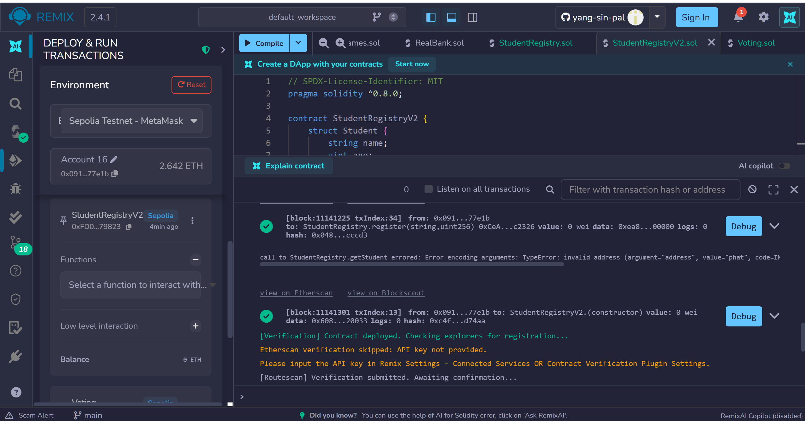
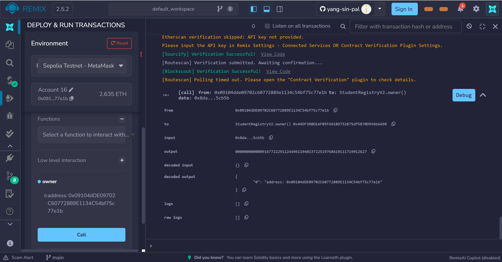
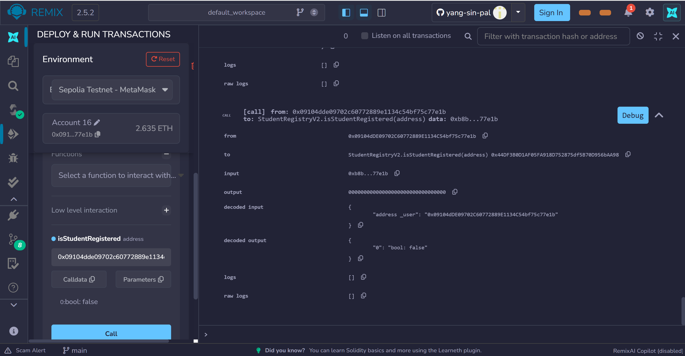
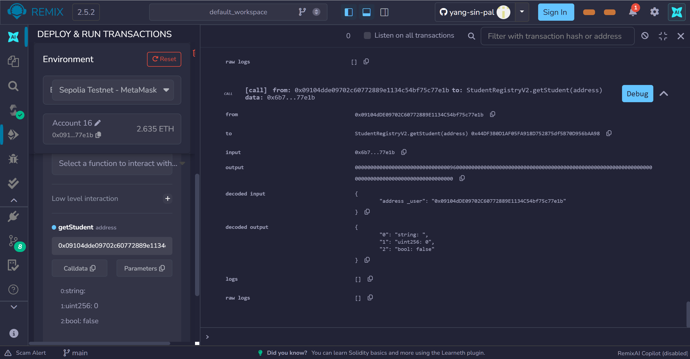
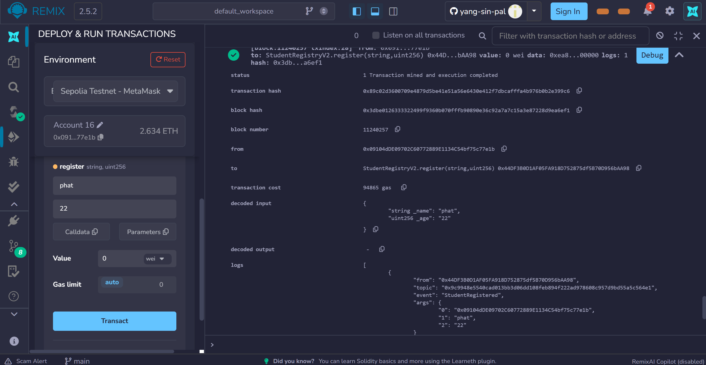
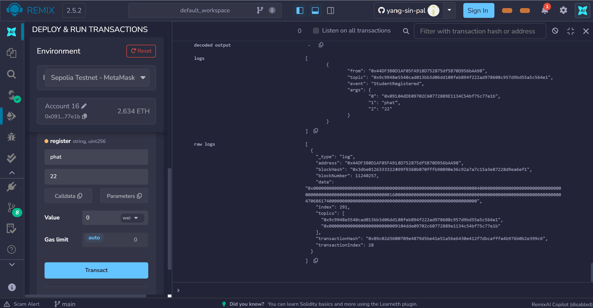
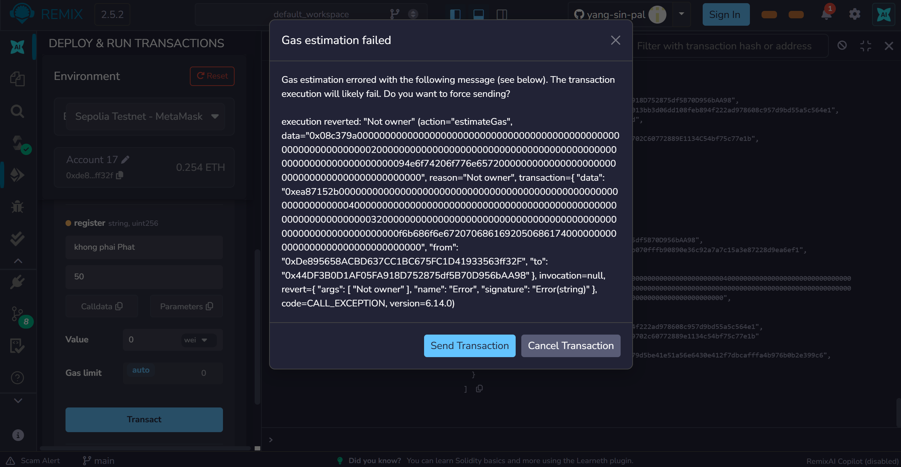
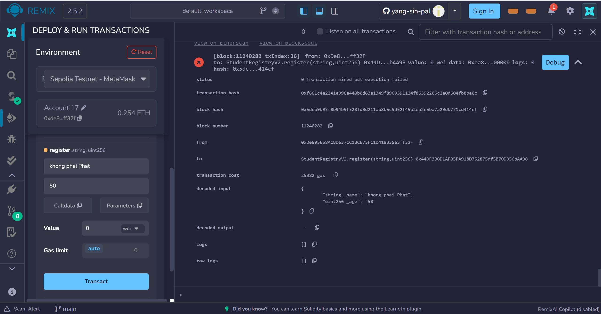
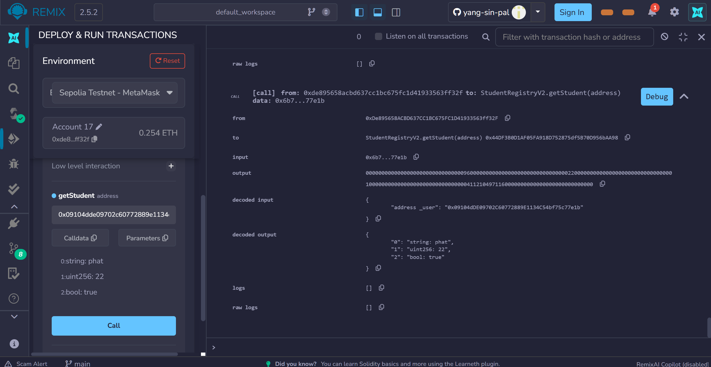

# Lesson 4.2 – Report
#### 1. Deploy the StudentRegistryV2 contract

#### 2. Check the owner address

#### 3. Check isStudentRegistered and getStudent before registering – result: false / empty

#### 4. Register account 1 with owner – "phat", age 22 – event emitted

#### 5. Register with non-owner – transaction fails (revert)

#### 6. Check getStudent for account 1 after registering – result: correct information

