# Lesson 4.3 – Report

#### 1. Deploy the Voting Contract
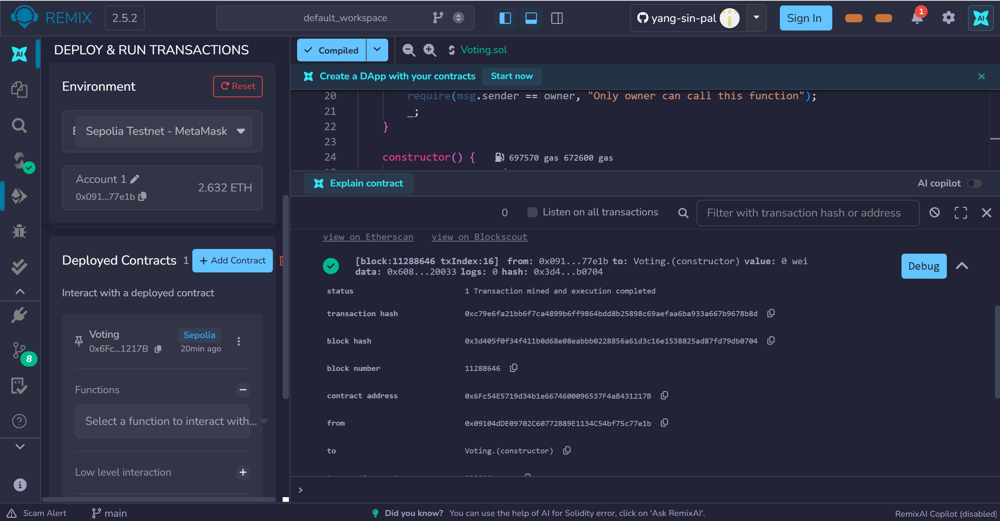

#### 2. Verify Owner is Account1
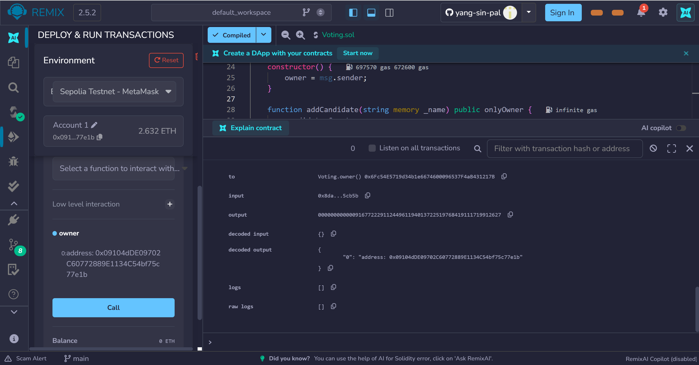

#### 3. Owner adds Candidate 1
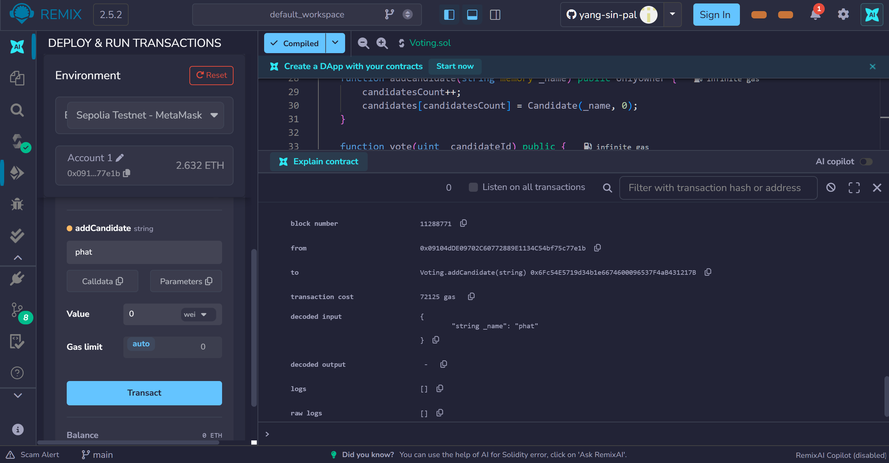

#### 4. Owner adds Candidate 2
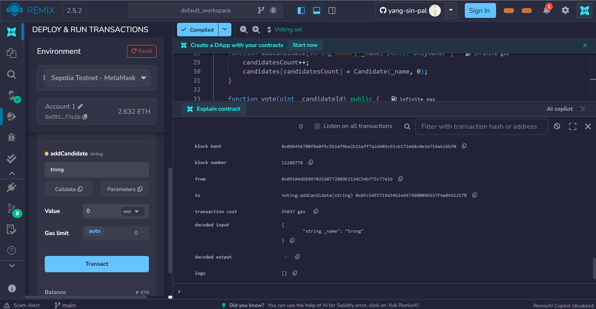

#### 5. Non-owner tries to add candidate (revert)
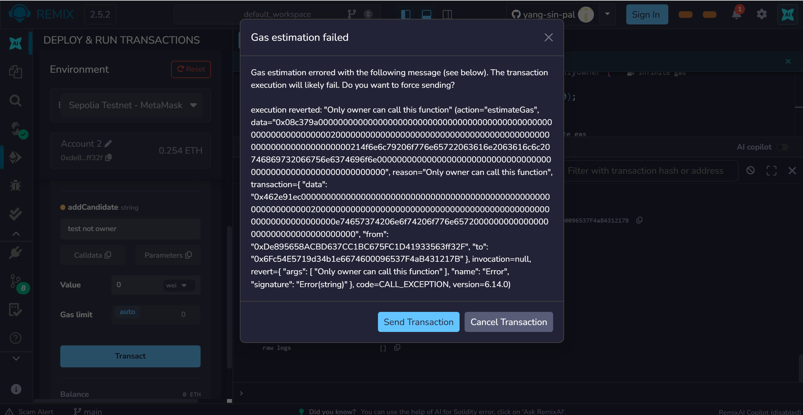

#### 6. Account2 votes for Candidate 1
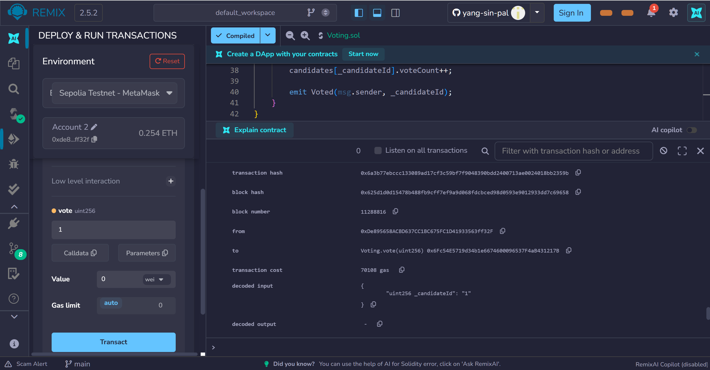

#### 7. Check Event Log
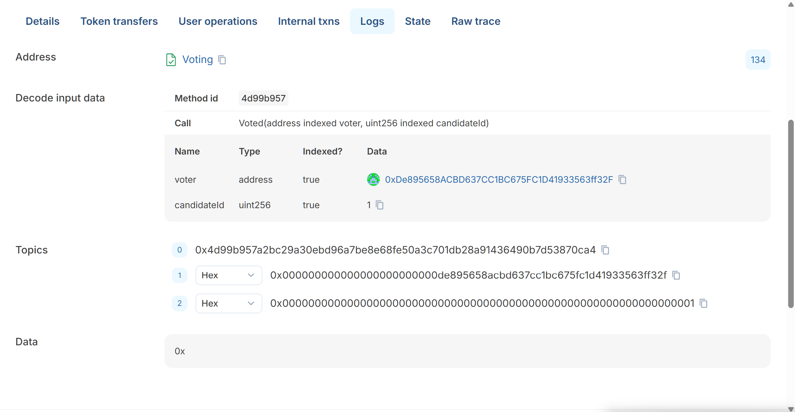

#### 8. Account2 tries to vote again (revert)
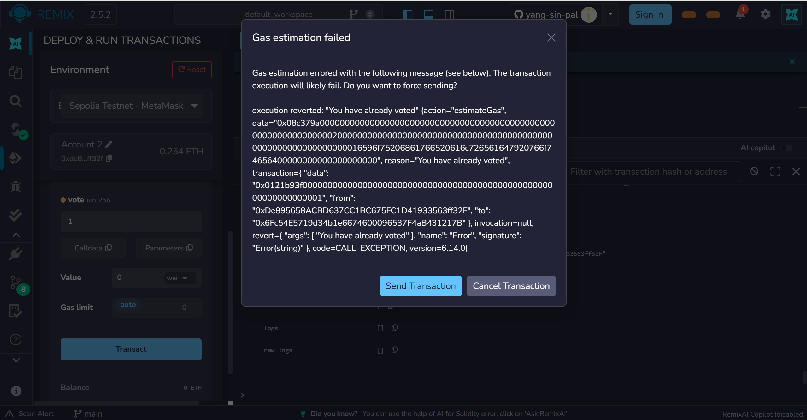

#### 9. Vote for non-existing candidate (revert)
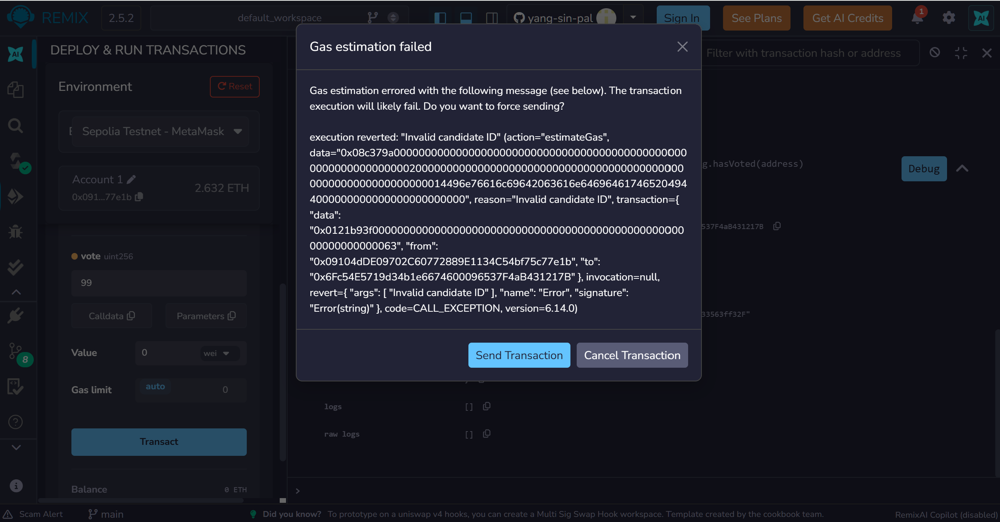

#### 10. Check vote count for Candidate 1
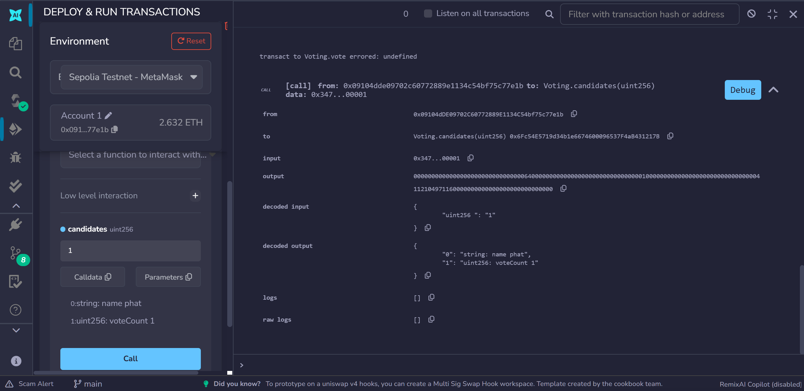

#### 11. Check vote count for Candidate 2
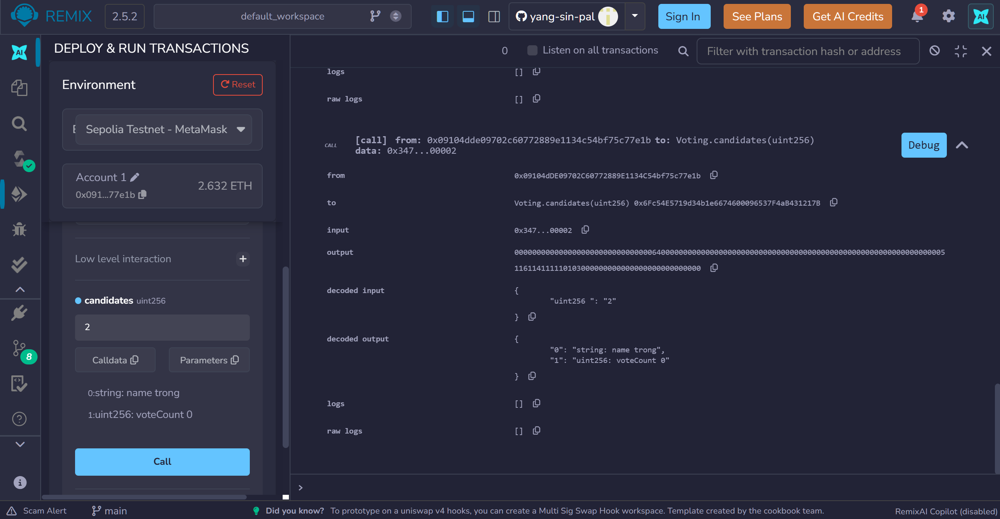
