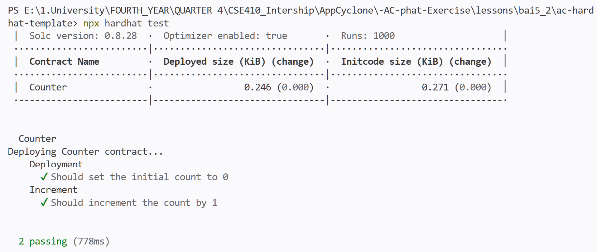
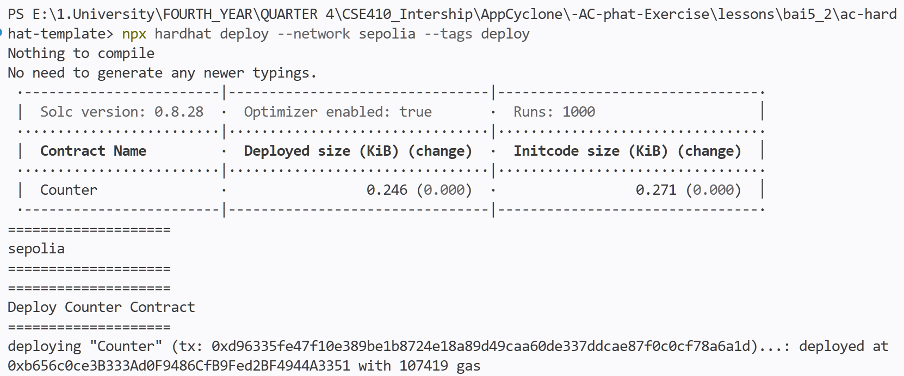
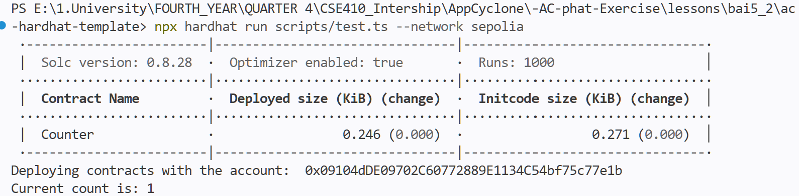
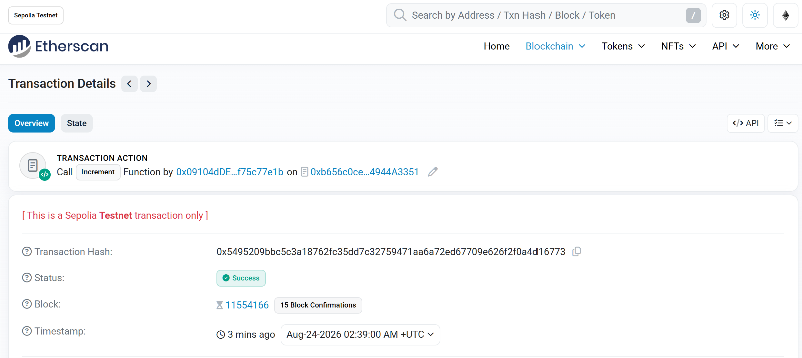

# Lesson 5.2 – Report

> - **Account (deployer):** [`0x09104dDE09702C60772889E1134C54bf75c77e1b`](https://sepolia.etherscan.io/address/0x09104dDE09702C60772889E1134C54bf75c77e1b)
> - **Contract:** [`0xb656c0ce3B333Ad0F9486CfB9Fed2BF4944A3351`](https://sepolia.etherscan.io/address/0xb656c0ce3B333Ad0F9486CfB9Fed2BF4944A3351)
> - **Deploy tx:** [`0xd96335fe47f10e389be1b8724e18a89d49caa60de337ddcae87f0c0cf78a6a1d`](https://sepolia.etherscan.io/tx/0xd96335fe47f10e389be1b8724e18a89d49caa60de337ddcae87f0c0cf78a6a1d) (block 11553717)

#### 1. Run unit tests (`npx hardhat test`) — count = 0 initially, = 1 after `increment()` on local network

#### 2. Deploy Counter to Sepolia (`npx hardhat deploy --network sepolia --tags deploy`)

#### 3. Call `increment()` via Ethers.js and read `getCount()` — prints `1`

#### 4. Verify the transaction on Sepolia Etherscan

