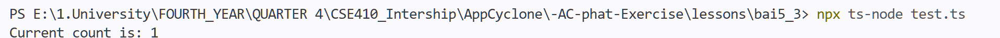

# Lesson 5.3 – Report

> - **Contract:** [`0xb656c0ce3B333Ad0F9486CfB9Fed2BF4944A3351`](https://sepolia.etherscan.io/address/0xb656c0ce3B333Ad0F9486CfB9Fed2BF4944A3351) (Counter deployed in Lesson 5.2)
> - **ABI:** `["function getCount() public view returns (uint)", "function increment() public"]`

#### 1. Script ethers.js connects to the contract via ABI and calls `getCount()` (`npx ts-node test.ts`) — prints `Current count is: 1`

---

## 📝 Notes

### Fixes applied before running
- `test.ts:4` initially pointed to `https://eth-sepolia.public.blastapi.io` — BlastAPI's public RPC was no longer active (returned a 403 error), so it was replaced with `https://ethereum-sepolia-rpc.publicnode.com`
- The placeholder address at `test.ts:10` was replaced with the Counter contract deployed in Lesson 5.2 (`0xb656c0ce3B333Ad0F9486CfB9Fed2BF4944A3351`)

### Key takeaways — how a frontend interacts with a smart contract
- A frontend never communicates directly with the blockchain; it sends JSON-RPC requests through a **provider** (in this case: `ethers.JsonRpcProvider`)
- The **ABI** is the "interpreter": it converts function signatures like `"getCount()"` into properly encoded calldata (function selector + parameters) and decodes the returned data back into JS values — without an ABI, you cannot call functions or read results
- Reading and writing differ by signer:
  - `getCount()` (view) → only needs a provider, uses free `eth_call`, creates no transaction — exactly as in this script
  - `increment()` (state-changing) → requires a **signer** + gas; that is covered in Lesson 5.2

### Requirements for a frontend to interact with a contract
1. **Contract address** on a specific network (chainId)
2. **Correct ABI** matching the functions/events to be called
3. **JSON-RPC endpoint** for that network (public RPC, Alchemy/Infura, or `window.ethereum` injected by MetaMask)
4. Read-only calls (view): only need a **provider**
5. State-changing calls: need a **signer/wallet** with funds (e.g., MetaMask private key) + gas on the correct network
