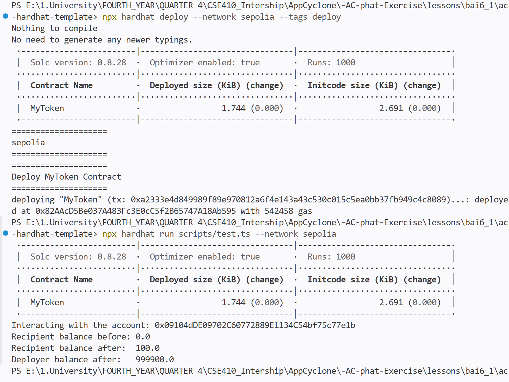
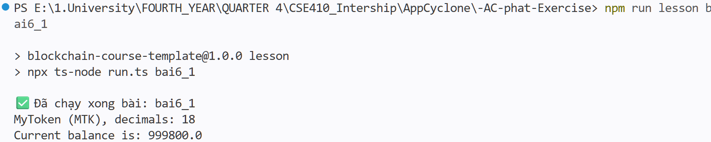

# Bài 6.1 – Báo cáo

#### 1. Viết contract `MyToken.sol` — ERC20 kế thừa OpenZeppelin, tên "MyToken", symbol "MTK", mint toàn bộ 1,000,000 token cho deployer trong constructor

```solidity
// SPDX-License-Identifier: MIT
pragma solidity ^0.8.28;

import "@openzeppelin/contracts/token/ERC20/ERC20.sol";

contract MyToken is ERC20 {
    constructor() ERC20("MyToken", "MTK") {
        _mint(msg.sender, 1_000_000 * 10 ** decimals()); // 18 decimals default
    }
}
```

#### 2. Viết script deploy và triển khai lên Sepolia bằng hardhat-deploy

Chạy lệnh `npx hardhat deploy --network sepolia --tags deploy` — script in tên network, địa chỉ contract và transaction:



- Địa chỉ contract: [`0x82AAcD5Be037A483Fc3E0cC5f2B65747A18Ab595`](https://sepolia.etherscan.io/address/0x82AAcD5Be037A483Fc3E0cC5f2B65747A18Ab595)
- Đã verify source code trên **Etherscan** (Standard JSON Input)

#### 3. Chạy `test.ts` kiểm tra balance của deployer qua RPC PublicNode

File test đọc `name` / `symbol` / `decimals` / `balanceOf(deployer)` qua ABI ERC20 với ethers v6, chạy bằng `npm run lesson bai6_1`:



- Kết quả: `MyToken (MTK), decimals: 18`
- Balance của deployer: `999800.0 MTK` = 1,000,000 ban đầu trừ 2 giao dịch transfer thử nghiệm 100 MTK mỗi giao dịch
