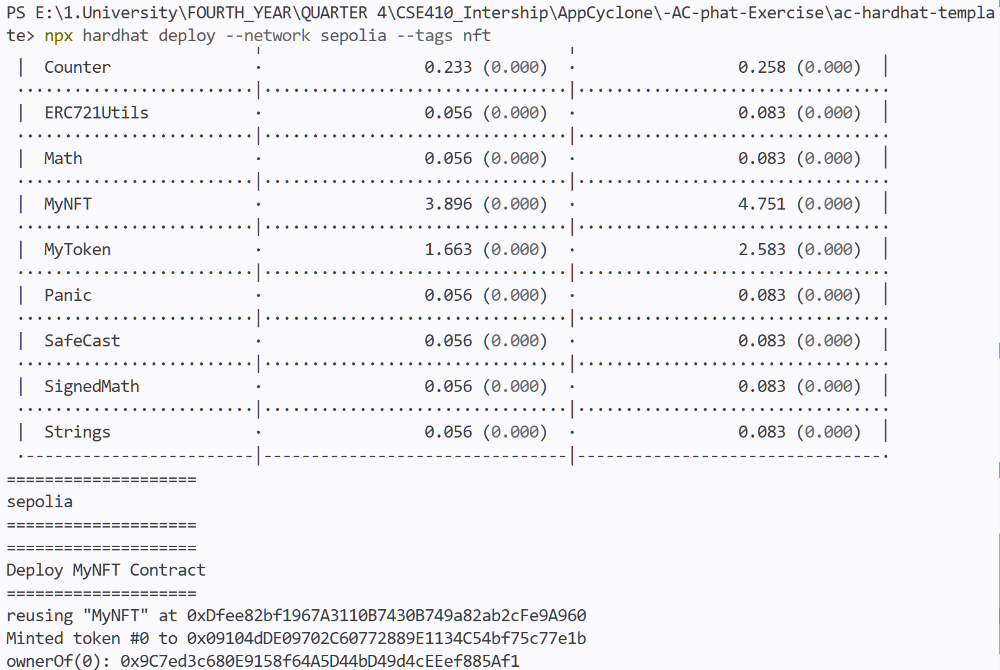
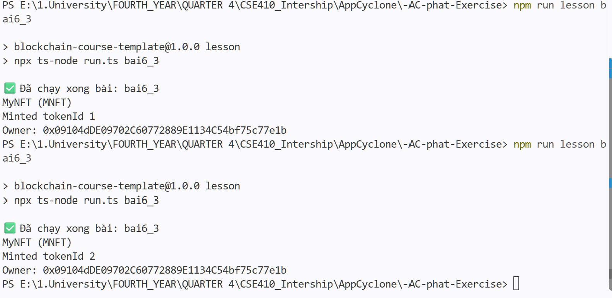

# Lesson 6.3 – Report

#### 1. Write the `MyNFT.sol` contract — ERC721 inheriting from OpenZeppelin v5, name "MyNFT", symbol "MNFT", `mint(address)` callable only by the owner, using `_safeMint` with incrementing id via `nextTokenId`

```solidity
// SPDX-License-Identifier: MIT
pragma solidity ^0.8.28;

import "@openzeppelin/contracts/token/ERC721/ERC721.sol";
import "@openzeppelin/contracts/access/Ownable.sol";

contract MyNFT is ERC721, Ownable {
    uint256 public nextTokenId;

    constructor() ERC721("MyNFT", "MNFT") Ownable(msg.sender) {}

    function mint(address to) external onlyOwner {
        _safeMint(to, nextTokenId);
        nextTokenId++;
    }
}
```

#### 2. Write unit tests and rebuild the template

Add `test/MyNFT.test.ts` with 6 tests: name/symbol correct, `nextTokenId` initialized to 0, after minting `ownerOf(0)` returns the deployer, `nextTokenId` increments after each mint, non-owner mint reverts with custom error `OwnableUnauthorizedAccount`. Run `npx hardhat clean && npx hardhat compile && npx hardhat test` — **13 passing** total (2 Counter + 5 MyToken + 6 MyNFT).

Two build errors were resolved along the way:

- Hardhat 2 defaults to the `paris` EVM target, which causes OpenZeppelin 5.x (using the `mcopy` opcode from Cancun) to fail at compile time → pin `evmVersion: "cancun"` in `hardhat.config.ts`
- `@nomicfoundation/hardhat-chai-matchers` v1 declares peer ethers ^5, which conflicts with the ethers v6 used in the template → upgrade to `^2.0.0` and import the matcher in the test file to use `revertedWithCustomError`

#### 3. Write the deploy script (`deploy/03-nft.ts`, tag `nft`) and deploy to Sepolia

The script follows the spec: deploy contract → mint token #0 to the deployer → print `ownerOf(0)`. Run the command `npx hardhat deploy --network sepolia --tags nft`:



- Contract address: [`0xDfee82bf1967A3110B7430B749a82ab2cFe9A960`](https://sepolia.etherscan.io/address/0xDfee82bf1967A3110B7430B749a82ab2cFe9A960)
- The first run deployed to the network successfully but the script threw an error afterward: `getNamedAccounts()` returns addresses as **strings**, so `.address` was `undefined` → fixed by passing `deployer` directly into `mint()`
- On the second run hardhat-deploy printed `reusing "MyNFT" …`: hardhat-deploy 1.x compares the original deploy transaction with the one about to be sent — bytecode + constructor args are unchanged ⇒ it reuses the old address regardless of `skipIfAlreadyDeployed: false`. Because the contract was reused, token #0 belongs to a random address from the previous script run (`0x9C7e…5Af1`, whose private key was discarded), and token #1 is the one that belongs to the deployer
- Source code was verified on Etherscan (Etherscan automatically matched the bytecode as an Exact/Similar Match against the previously verified version)

#### 4. Complete the lesson's `test.ts` and run `npm run lesson bai6_3`

The test file uses ethers v6 + RPC PublicNode, a minimal ERC721 ABI (`name`, `symbol`, `nextTokenId`, `mint`, `ownerOf`), and the signing wallet is loaded from `$env:TESTNET_PRIVATE_KEY`; it reads the contract info, mints one NFT to the wallet, and prints the owner. Run twice consecutively — `nextTokenId` increments across each run:


