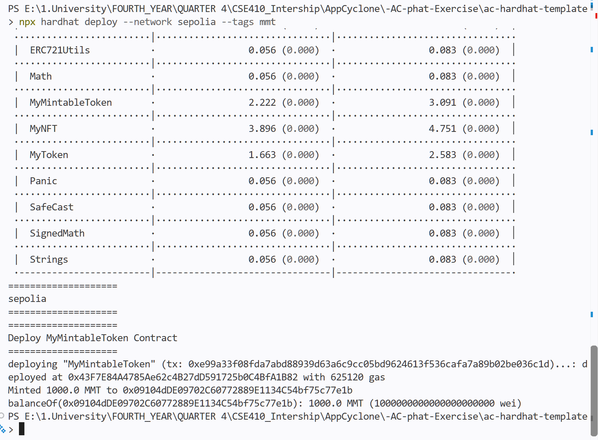
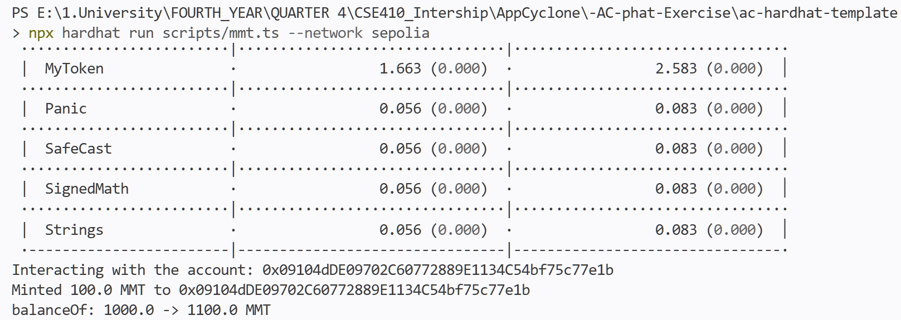
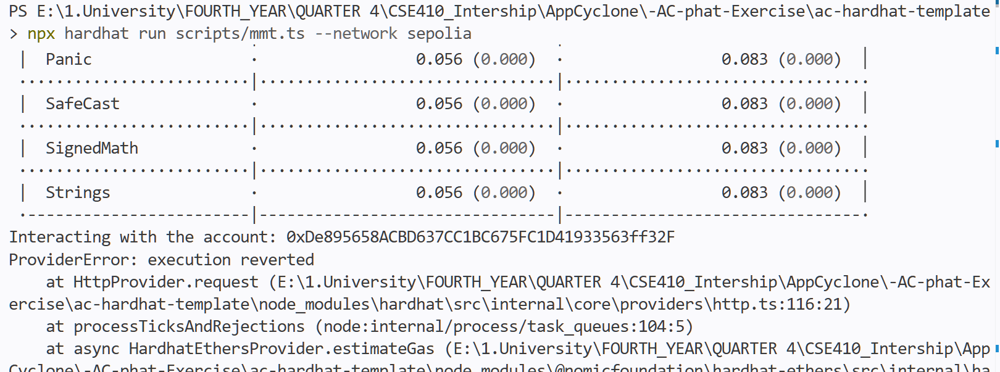

# Bài 7.1 – Báo cáo

#### 1. Viết contract `MyMintableToken.sol` — ERC20 kế thừa OpenZeppelin v5, tên "MyMintableToken", symbol "MMT", hàm `mint(address to, uint256 amount)` chỉ owner gọi được, dùng `_mint`, không phát hành token ban đầu trong constructor

```solidity
// SPDX-License-Identifier: MIT
pragma solidity ^0.8.28;

import "@openzeppelin/contracts/token/ERC20/ERC20.sol";
import "@openzeppelin/contracts/access/Ownable.sol";

contract MyMintableToken is ERC20, Ownable {
    constructor() ERC20("MyMintableToken", "MMT") Ownable(msg.sender) {}

    function mint(address to, uint256 amount) external onlyOwner {
        _mint(to, amount);
    }
}
```

#### 2. Viết script deploy (`deploy/04-mymintabletoken.ts`, tag `mmt`) và triển khai lên Sepolia

Script theo spec: deploy contract → mint 1000 MMT cho deployer → in balance của deployer (cả định dạng MMT lẫn wei). Chạy lệnh `npx hardhat deploy --network sepolia --tags mmt`:



- Địa chỉ contract: [`0x43F7E84A4785Ae62c4B27dD591725b0C4BfA1B82`](https://sepolia.etherscan.io/address/0x43F7E84A4785Ae62c4B27dD591725b0C4BfA1B82)
- Deploy mới hoàn toàn — mint thành công 1000.0 MMT cho deployer và in ra `balanceOf`

#### 3. Chạy script tương tác `scripts/mmt.ts` bằng tài khoản owner

Script mint thêm 100 MMT cho deployer rồi in số dư trước/sau. Chạy `npx hardhat run scripts/mmt.ts --network sepolia` với key thường:



- Kết quả: `balanceOf: 1000.0 -> 1100.0 MMT` — mint thành công vì `msg.sender` là owner

#### 4. Chạy lại script bằng một tài khoản không phải owner

Tạo ví burner, nạp Sepolia ETH từ faucet trước, rồi chạy script trong một cửa sổ PowerShell với biến môi trường phiên (ghi đè `.env`, không cần sửa file nào):

```powershell
$env:TESTNET_PRIVATE_KEY = "<burner private key>"
npx hardhat run scripts/mmt.ts --network sepolia
```



- Giao dịch bị revert với custom error `OwnableUnauthorizedAccount(<địa chỉ burner>)` — chứng minh trực tiếp trên testnet rằng modifier `onlyOwner` hoạt động đúng

---

Ghi chú: contract chưa được verify trên Etherscan — việc verify thủ công (Standard JSON Input từ `solcInputs/999f835e6a53cc806b1cec02f4c86694.json`) cùng với việc gọi trực tiếp hàm `mint` trên Etherscan bằng cả owner lẫn non-owner sẽ được thực hiện ở **bài 7.2**.
