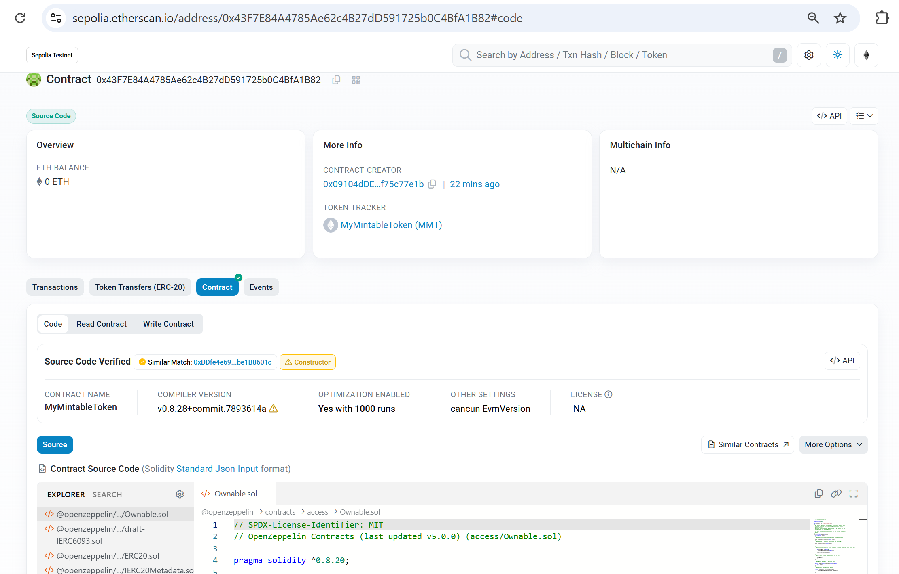
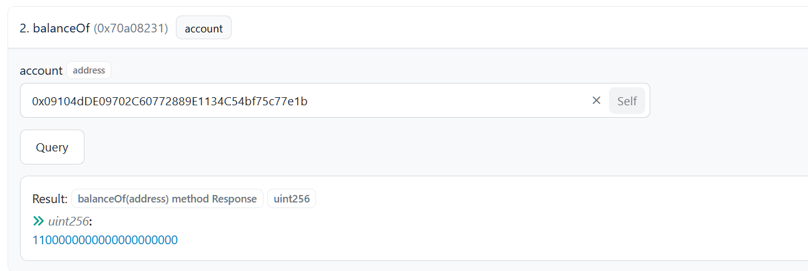
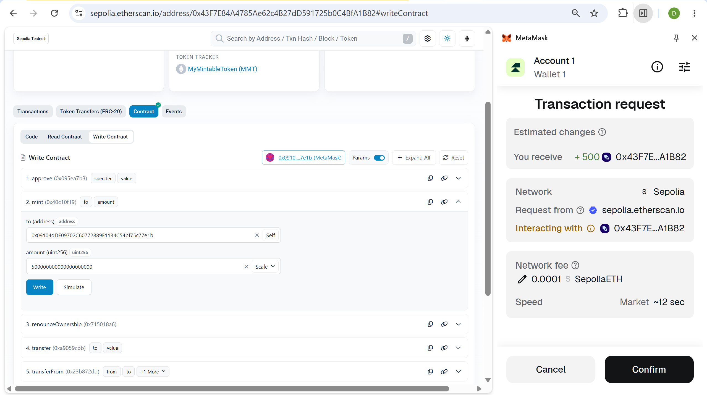
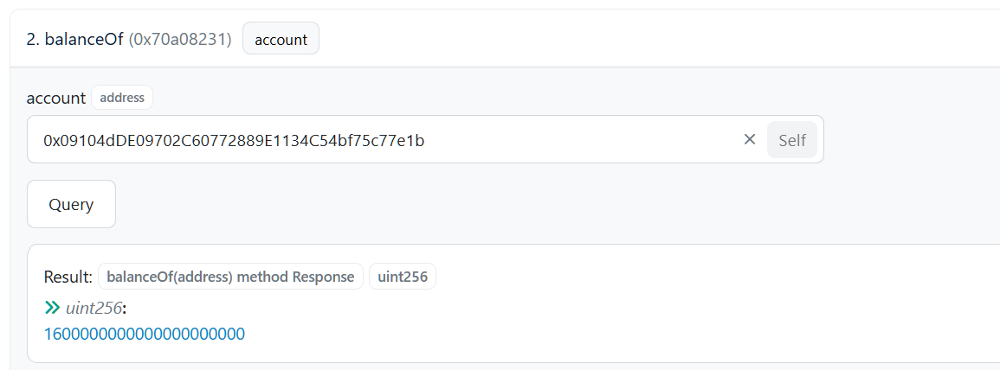
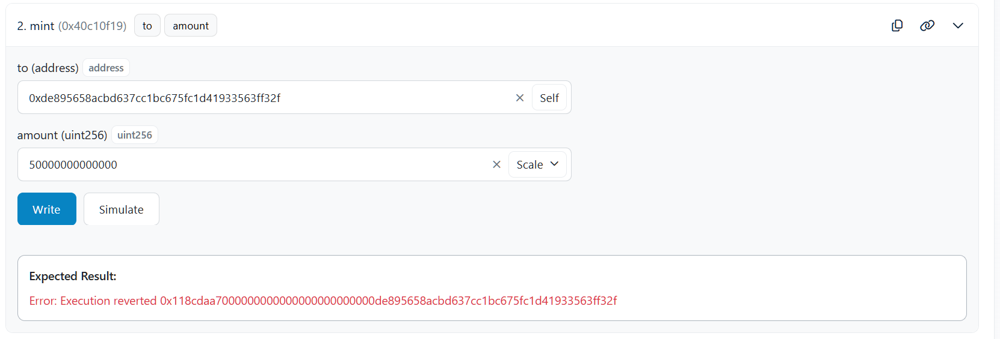

# Exercise 7.2 – Report

#### 1. Background — the `MyMintableToken` contract was deployed in Exercise 7.1

- Address: [`0x43F7E84A4785Ae62c4B27dD591725b0C4BfA1B82`](https://sepolia.etherscan.io/address/0x43F7E84A4785Ae62c4B27dD591725b0C4BfA1B82)
- The `@nomicfoundation/hardhat-verify` plugin and `etherscan.apiKey` configuration (read from the `ETHERSCAN_API` environment variable) are already present in `ac-hardhat-template/hardhat.config.ts`, so Steps 1–3 of the assignment do not need to be redone

#### 2. Why `npx hardhat verify` (Step 4 of the assignment) cannot be run

The Hardhat 2 toolchain pins `hardhat-verify` to the 2.x line, while Etherscan retired API V1 (May 2025) — the very API this CLI still calls — so the verify command is effectively dead on this toolchain. The alternative workflow: manually submit Standard JSON Input from `deployments/sepolia/solcInputs/999f835e6a53cc806b1cec02f4c86694.json` through the web interface.

#### 3. Etherscan automatically verified the contract — Similar Match

Before manual verification could even be attempted, Etherscan automatically matched the contract's bytecode against a previously verified deployment (**Similar Match** — a mechanism that matches bytecode while ignoring constructor args). As a result, the source code is publicly displayed and both the Read/Write Contract tabs are enabled:

#### 4. Reading data via the Read Contract tab

Called `balanceOf(owner)` on the Read Contract tab to view the owner's current balance:

#### 5. Calling `mint` as owner via the Write Contract tab — succeeded

Connected the owner (deployer) wallet and called `mint(to, amount)`:

Checked the balance again — it increased by exactly the amount just minted:

→ The `onlyOwner` modifier allows the owner to call `mint` normally.

#### 6. Calling `mint` as non-owner — reverted as expected

Connected the burner wallet (not the owner) and called `mint` — the transaction failed on Etherscan with custom error `OwnableUnauthorizedAccount`:

→ Directly demonstrated on Etherscan that only the owner can mint tokens.

---

## 🎯 Submission Results

- Contract address: `0x43F7E84A4785Ae62c4B27dD591725b0C4BfA1B82`
- Verified Etherscan link: [contract Code tab](https://sepolia.etherscan.io/address/0x43F7E84A4785Ae62c4B27dD591725b0C4BfA1B82#code)
- Screenshot of successful verification: Section 3
